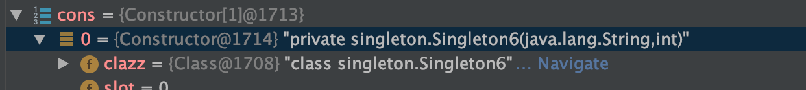
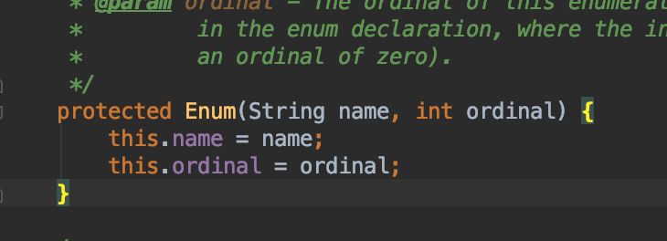
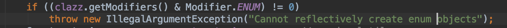

# 1.单例模式

作用：

1.避免产生多个实例消耗资源

2.多个实例多次调用可能导致结果出错


场景：

只需要一个实例的对象，如各种Factory、Manager、线程池、配置文件等


设计思想：

1.构造函数私有化 防止使用者自行new对象

2.在类中new对象

3.提供一个允许外部访问的接口，以获取2中new的对象

## 1.1  饿汉式

```
/**
 * 饿汉式
 */
public class Singleton1 {
    private Singleton1(){};
    private static Singleton1 instance=new Singleton1();
    public static Singleton1 getInstance(){
        return instance;
    }
```

实现方式是在类加载的时候完成了new Singleton1()的过程，同样的写法还有将new语句放在静态代码块中，思想上是一致的。

其优点是实现简单 且线程安全

缺点是无论是否使用 在类初始化时对象都被创建出来了


## 1.2 懒汉式

```
/**
 * 懒汉式
 */
public class Singleton2 {
    private Singleton2(){};
    private static Singleton2 instance;

    public static Singleton2 getInstance(){
        if(instance==null)
            instance=new Singleton2();
        return instance;
    }
}
```

这种实现在第一次被使用时才开始加在 理想中的情况是 if语句在第一次访问后就不再进入

但实际上当有两个线程几乎同时到达if(instance==null)时 当A线程进入if 却还没来得及执行instance=new Singleton2时 B线程也开始进行if判断 而此时由于A线程的instance还没有被new出来 那么B线程也进入if 执行new操作 此时就会出现两个实例 若想还原这种情况可以在new语句前加上sleep语句


## 1.3 线程安全的懒汉式

为解决1.2中线程不安全的问题 可以通过加锁的方法来避免多个线程同时进入if语句

```
public class Singleton3 {
    private Singleton3(){};
    private static Singleton3 instance;

    public static synchronized Singleton3 getInstance(){
        if(instance==null){
            try{
                Thread.sleep(10);
            }
            catch (Exception e){}
            instance=new Singleton3();
        }
        return instance;
    }
}
```

但是这种方法带来的后果就是效率太低，所有对getInstance方法的调用，试图获取对象实例，都需要等待锁释放

也可以把锁加在方法内 但是这样和加在方法上是一样的 核心问题是if(instance==null)这句如果被上锁 那么就会导致所有调用getInstance方法都需要等待锁

```
public static Singleton3 getInstance(){
    synchronized(Singleton3.class){
        if(instance==null){
            try{
                Thread.sleep(10);
            }
            catch (Exception e){}
            instance=new Singleton3();
        }
        return instance;
    }
}
```

但是如果锁再往下移动一行 看似是保证了只有最初的一次请求会加锁

```
public static Singleton3 getInstance(){
        if(instance==null) {
            synchronized (Singleton3.class) {
                try {
                    Thread.sleep(10);
                } catch (Exception e) {
                }
                instance = new Singleton3();
            }
        }
        return instance;
}
```

但是这样是无法保证线程安全的，这是由于若某个线程A和B同时进入if后，A拿到了锁，执行了new语句后再释放锁，此时B又拿到了锁 那么对象就会被new两次


## 1.4 双重校验锁

```
public class Singleton4 {
    private Singleton4(){};
    private static volatile Singleton4 instance;

    public static Singleton4 getInstance(){
        if(instance==null){
            synchronized (Singleton4.class){
                if(instance==null)
                    instance=new Singleton4();
            }
        }
        return instance;
    }
}
```

通过两次if判断，在保证new语句只被执行一次的情况下改善了1.3带来的效率问题

在这种方法中，只有getInstance语句第一次被调用时，调用者才需要等待锁资源

**volatile关键字是必须的**

并不是说不加volatile就会导致可能有多个实例产生

而是在实例化过程中分为三个指令步骤

1.分配内存空间

2.调用构造方法 进行初始化

3.将对象赋值给变量

这几个步骤有可能会被JVM进行指令重排优化 2和3步骤都依赖1步骤 所以1一定是最先执行的 但是2和3的顺序可能颠倒

如果先进行了1后 直接进行了3 那么此时变量并不为null 也就是说他是不会进入外层的if(instance==null)的

而这时候这个对象实际上是不完整的 因为他并没有进行2步骤的初始化过程 就可能会被直接return回去 这个被return回去的对象就是一个异常的对象

所以加上volatile关键字 可以避免指令重排的发生


## 1.5 静态内部类

```
public class Singleton5 {
    private Singleton5(){};
    private static class Singleton5Holder{
        private static final Singleton5 instance=new Singleton5();
    }
    public static Singleton5 getInstance(){
        return Singleton5Holder.instance;
    }
}
```

这种方式与1.1的饿汉式相似 区别在于1.1在Singleton类被装载时 对象就会实例化

而这种方式中的holder类在Singleton类被装载时不会被装载，对象不会直接被实例化，而是在getInstance方法被调用时holder类被装载，对象进行实例化，

JVM来保证了线程的安全性，类加载只会加载一次，holder只会被加载一次，也就保证了new语句只执行一次


## 1.6 枚举实现

```
public enum Singleton6 {
    INSTANCE;

    public static Singleton6 getInstance(){
        return INSTANCE;
    }
}
```

不添加getInstance方法直接使用Singleton.INSTANCE也可以

枚举实现可以防止通过反射的方式强行调用私有的构造器

在前五个类中都可以通过以下方式实现

```
//        Singleton5 singleton5A=Singleton5.getInstance();
//        Singleton5 singleton5B=Singleton5.getInstance();
//        System.out.println(singleton5A==singleton5B);
//        Constructor con=Class.forName("singleton.Singleton5").getDeclaredConstructor();
//        con.setAccessible(true);
//        Object obj=con.newInstance();
//        Singleton5 singleton5C=(Singleton5)obj;
//        System.out.println(singleton5A==singleton5C);
```

通过getDeclaredConstructor()方法获取构造器后setAccessible(true);

调用即可

但是用这种方式测试枚举单例时会报错：

Exception in thread "main" java.lang.NoSuchMethodException: singleton.Singleton6.<init>()
	at java.lang.Class.getConstructor0(Class.java:3082)
	at java.lang.Class.getDeclaredConstructor(Class.java:2178)


这是因为并没有找到无参的构造器

通过Constructor[] cons=Class.forName("singleton.Singleton6").getDeclaredConstructors();

获取枚举单例的构造器发现：



只有一个(String,int)类型的构造器

查看Enum源码可以找到这个构造器：



直接指定这个构造器

```
Constructor con=Class.forName("singleton.Singleton6").getDeclaredConstructor(String.class,int.class);
```

仍然报错java.lang.IllegalArgumentException: Cannot reflectively create enum objects

翻译过来很明显就是不能用反射的方式创建一个枚举对象

在Constructor类的newInstance方法中抛出了这个异常



同时可以避免序列化问题


# 2.策略模式

## 定义

定义了算法族，分别封装起来，让它们之间可相互替换，此模式让算法的变化独立于使用算法的客户。

## 说明

将可能改变的部分（行为、算法）抽离出来作为一组独立的类，通常用接口，具体的行为/算法实现该接口，可以轻松的扩充、改变，需要用到这一行为/算法的对象超类中持有行为类接口对象，将行为委托给行为类对象去处理，通过传入不同的具体行为实现，可以使对象有不同的行为。通过超类中对行为对象的setter方法，可以随时改变行为。

## HeadFirst举例

一系列鸭子玩具都继承Duck类，Duck类有quack(叫)、swim方法的实现和外观的抽象，新的玩具继承这个类并实现外观方法。此时想要让鸭子玩具可以飞，在Duck超类中添加了fly方法，结果导致了橡皮鸭子也会飞，引出了问题：在超类中添加方法，会导致某些不应该具有这一行为的子类也具有该行为。

这样只能在子类中覆盖掉父类的方法，使得子类在某些行为上有自己的实现，使用继承并不是最好的方法。


使用接口，如设计一个flyable接口，让会飞的鸭子去实现这一接口，但是如果不同的子类对于飞行有不同的实现，那么也无法完成。


如果将可能改变的部分，fly和quack部分抽离出来，建立两组类，分别为flyBehavior 和quackBehavior ,让这两组类去实现动作，然后让Duck类持有这两个变量，通过构造器注入和setter注入的方式，在创建具体Duck子类的时候传入某个实现了behavior接口的实例，使其拥有某种具体行为，setter方法可以在中途更换行为。

## 代码实现

使用HeadFirst中练习中的例子：

设计一款游戏，游戏有不同的角色，不同角色有自己的属性，角色可以使用不同的武器进行攻击，但是一次只能使用一种，可以在游戏的过程中切换武器。


1.Character类为角色超类

```
public abstract class Character {
    String name;
    Weapon weapon;

    public void setWeapon(Weapon weapon){
        this.weapon=weapon;
    }

    public void attack(){
        //将攻击行为委托给武器
        weapon.attack();
    }
}
```

2.Weapon是不同武器所需实现的接口

```
public interface Weapon {
    public void attack();
}
```

3.Arrow与Knife是具体武器

```
public class Arrow implements Weapon {

    @Override
    public void attack() {
        System.out.println("弓箭攻击");
    }
}
public class Knife implements Weapon{
    @Override
    public void attack() {
        System.out.println("小刀攻击");
    }
}
```

4.Knight是某一具体角色实现

```
public class Knight extends Character {
    public Knight(String name){
        this.name=name;
    }
}
```

5.测试

```
public class Test {
    public static void main(String[] args) {
        Character character=new Knight("骑士A");
        character.setWeapon(new Knife());
        character.attack();
        character.setWeapon(new Arrow());
        character.attack();
    }
}
```

先使用knife攻击 更换武器后使用arrow攻击

## 总结

个人认为的策略模式的要点在于

1.明确哪些部分是可替换/需要替换的算法簇

2.设置behavior接口，具体的算法需要实现这一接口

3.使用这一算法的客户（对象）持有behavior遍历，可以随时替换

4.将“使用算法”这一行为委托给算法本身进行


优点：

1.可以随时切换算法

2.良好的拓展性，增加算法的时候实现接口即可


缺点：

1.每个算法（策略）都是一个类，类的数量会很多

2.如果让算法调用者来选择算法，那么需要调用者了解所有的算法，这也会暴露算法的具体实现

实际使用中策略模式可以与工厂模式相结合，这样调用者并不知道算法的具体实现，得到的是一个behavior


# 3.观察者模式

## 定义

在对象之间定义一对多的依赖，这样当一个对象改变状态，依赖他的对象都会收到通知，并自动更新

## 场景

一个对象（目标对象）的状态发生改变，所有的依赖对象（观察者对象）都将得到通知，进行广播通知

## 举例

气象站的WeatherData对象有几个天气属性，当这些属性改变时，几个公告板应该收到通知并展示新的天气属性

## 实现

实现的核心点在于，在subject中添加一个观察者列表和对应的add/remove方法来增加/删除观察者，以及一个通知方法来通知所有的观察者

可以用一个subject接口，实现subject接口的具体主题都应该具有这三个方法。

也可以选择继承java.util包中的Observable类

Observable类中用一个

```
private Vector<Observer> obs;
```

来保存所有观察者

构造方法中初始化该列表

```
public Observable() {
    obs = new Vector<>();
}
```

拥有addObserver deleteObserver方法来添加/取消订阅

```
notifyObservers()和notifyObservers(Object arg) 
```

两个方法分别对应pull和push两种数据传递方式

前者实际上是调用了后者notifyObservers(null);

后者即遍历观察者列表依次调用Observer的update方法

Observer是一个接口，其update方法如下：

```
void update(Observable o, Object arg);
```

传入一个observable对象和一个数据对象

pull方法调用的update是传入了空的arg对象，只传入了observable对象

使得订阅者主动从observable中get需要的数据（需要observable提供getter类似方法）

push方法将需要发送给订阅者的数据组装成Object，调用update方式传递给订阅者


observable中还包含setChanged() hasChanged()和clearChanged()方法和对应的boolean变量

这可以更加有弹性的在数据发生改变时选择是否通知订阅者

比如当数据变动极小时，并不调用hasChanged方法，这样就不会通知订阅者


实现中使用了pull形式

Subject：

```
public class SubjectA extends Observable {
    private String message;

    public String getMessage(){return message;}

    public void setMessage(String message){
        this.message=message;
        setChanged();
        notifyObservers();
    }
}
```

Observer

```
public class ObserverA implements Observer {
    @Override
    public void update(Observable o, Object arg) {
        if(o instanceof SubjectA){
            System.out.println("接受到来自SubjectA的数据"+((SubjectA) o).getMessage());
        }
    }
}
```

Test:

```
public class Test {
    public static void main(String[] args) {
        SubjectA subjectA=new SubjectA();
        ObserverA observerA=new ObserverA();
        subjectA.addObserver(observerA);
        subjectA.setMessage("Test");
    }
}
```

# 4.装饰者模式

## 定义

动态地将责任（功能）附加到对象身上，比继承更加具有弹性

## 场景

扩展一个类的功能 动态的增加/删除功能

在不想增加过多子类的情况下扩展类 咖啡和小料

## 举例

不同装备具有不同的攻击力

镶嵌宝石可以增加装备的攻击力

一个装备可以镶嵌多个宝石

# 代码实现

1.装备接口

```
public interface Equipment {
    /**
     * 获取攻击力
     * @return
     */
     int getAttack();

    /**
     * 获取描述
     * @return
     */
     String getDesc();
}
```

2.剑

```
public class Sword implements Equipment {
    @Override
    public int getAttack() {
        return 100;
    }

    @Override
    public String getDesc() {
        return "剑";
    }
}
```

3.宝石超类 需要实现Equipment 这里的实现并不是为了“规范行为”，而是为了“规范类型”，使得装饰者本身也可以被装饰

```
public abstract class GemStone implements Equipment{
    protected Equipment equipment;

    public GemStone(Equipment equipment){
        this.equipment=equipment;
    }

    public abstract int getAttack();

    public abstract String getDesc();
}
```

4.红宝石

```
public class RedGemStone extends GemStone {
    public RedGemStone(Equipment equipment) {
        super(equipment);
    }

    @Override
    public int getAttack() {
        return 5+equipment.getAttack();
    }

    @Override
    public String getDesc() {
        return equipment.getDesc()+"+红宝石";
    }
}
```

5.绿宝石

```
public class GreenGemStone extends GemStone {
    public GreenGemStone(Equipment equipment) {
        super(equipment);
    }

    @Override
    public int getAttack() {
        return 8+equipment.getAttack();
    }

    @Override
    public String getDesc() {
        return equipment.getDesc()+"+绿宝石";
    }
}
```

6.测试

```
public class Test {
    public static void main(String[] args) {
        Equipment sword=new Sword();
        sword=new GreenGemStone(new GreenGemStone(new RedGemStone(sword)));
        System.out.println(sword.getAttack()); //121
        System.out.println(sword.getDesc()); //剑+红宝石+绿宝石+绿宝石
    }
}
```

# 5.工厂模式

## 简单工厂/静态工厂

computer接口

```
public interface Computer {
    void describeComputer();
}
```

两个实现

```
public class MacBookComputer implements Computer {
    @Override
    public void describeComputer() {
        System.out.println("This is a macbook");
    }
}
```


```
public class DellComputer implements Computer{

    @Override
    public void describeComputer() {
        System.out.println("This is a dell");
    }
}
```

工厂：

```
public  class ComputerFacotry {
    public static Computer createComputer(String name){
        Computer computer=null;
        if(name.equals("macbook"))
            computer=new MacBookComputer();
        if(name.equals("dell"))
            computer=new DellComputer();
        return computer;
    }
}
```

商店

```
public class Store {
    public void buy(Computer computer){
        computer.describeComputer();
    }
}
```

测试

```
public class Test {
    public static void main(String[] args) {
        Store store=new Store();
        Computer computer=ComputerFacotry.createComputer("macbook");
        store.buy(computer);
    }
}
```

### 说明：

简单工厂专门定义一个类用来创建其它类的实例，被创建的实例通常都具有共同的父类，这里我们相当于是创建生产电脑的工厂，客户需要购买什么样的电脑，只要输入类型编号就可以获取该电脑，而无需知道该电脑是如何被生产出来的

只不过是把if的判断和new的逻辑从原本的商店中移到了工厂中，简单工厂实际上并不算不上一个设计模式，而是一种编程习惯。

将制造对象这一行为抽离出来也可以使工厂作用于其他需要产生对象的地方。

在工厂中可以使用枚举来定义类与类型编号的对应关系。

缺点是如果此时需要新增一个类型的产品，那么就需要去修改factory的代码，从而违反了开闭原则


## 工厂方法模式

定义：

**定义一个用来创建对象的接口，让子类决定实例化哪一个类，让子类决定实例化延迟到子类。**

他针对每个产品提供一个工厂类，在客户端中判断使用哪个工厂类去创建对象

实现：

把原来的ComputerFactory抽象为一个接口

```
public  interface ComputerFacotry {
     Computer createComputer();
}
```

不同产品提供不同实现

```
public class MacBookFactory implements ComputerFacotry {
    @Override
    public Computer createComputer() {
        return new MacBookComputer();
    }
}
```

测试：

```
public class Test {
    public static void main(String[] args) {
        Store store=new Store();
        ComputerFacotry computerFacotry=new MacBookFactory();
        store.buy(computerFacotry.createComputer());
    }
}
```

工厂方法模式是针对每个产品提供一个工厂类，在客户端中判断使用哪个工厂类去创建对象

相比于简单工厂，创建对象的逻辑判断放在了工厂类中，客户不感知具体的类，但是其违背了开闭原则，如果要增加新的具体类，就必须修改工厂类。

对于工厂方法模式而言，是通过扩展来新增具体类的，符合开闭原则，但是在客户端就必须要感知到具体的工厂类，也就是将判断逻辑由简单工厂的工厂类挪到客户端，工厂方法的拓展很方便，如果有新的产品，创建新的工厂类和产品类即可，不用修改原有的代码，不过这样也会导致类的数量很多。


## 抽象工厂

当工厂模式创建的类扩展为一族类时，就可以称为抽象工厂

抽象工厂模式：提供一个创建一系列相关或相互依赖对象的接口，而无需指定它们具体的类

**工厂方法模式和抽象工厂模式基本类似，可以这么理解：当工厂只生产一个产品的时候，即为工厂方法模式，而工厂如果生产两个或以上的商品即变为抽象工厂模式。**

增加操作系统这一类产品，在Mac中搭配MacOS 在dell上搭配windows


增加操作系统接口

```
public interface OperatingSystem {
    void getSystemName();
}
```

和两个实现

```public class MacOSSystem implements OperatingSystem {    @Override    public void getSystemName() {        System.out.println(&quot;This is MacOsSystem&quot;);    }}
public class WindowsSystem implements OperatingSystem {
    @Override
    public void getSystemName() {
        System.out.println("This is windows System");
    }
}
```

```
public class MacOSSystem implements OperatingSystem {
    @Override
    public void getSystemName() {
        System.out.println("This is MacOsSystem");
    }
}
```

在ComputerFactory中添加操作系统的方法

```
OperatingSystem loadSystem();
```

在MacBookFactory中增加实现

```
public class MacBookFactory implements ComputerFacotry {
    @Override
    public Computer createComputer() {
        return new MacBookComputer();
    }

    @Override
    public OperatingSystem loadSystem() {
        return new MacOSSystem();
    }
}
```

在store类中增加use方法

```
public void use(OperatingSystem operatingSystem){
    operatingSystem.getSystemName();
}
```

测试

```
public class Test {
    public static void main(String[] args) {
        Store store=new Store();
        ComputerFacotry computerFacotry=new MacBookFactory();
        Computer computer=computerFacotry.createComputer();
        OperatingSystem operatingSystem=computerFacotry.loadSystem();

        store.buy(computer);
        store.use(operatingSystem);
    }
}
```

